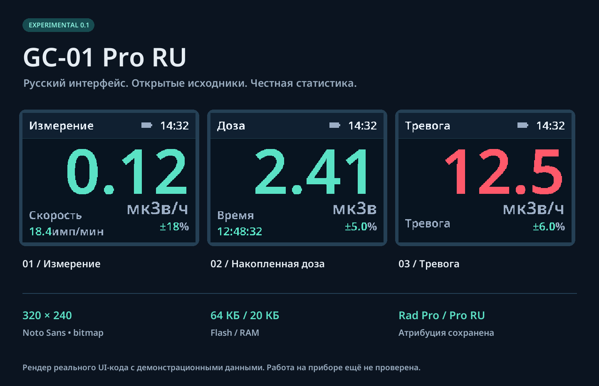

<div align="center">

# GC-01 Pro RU

**Русская экспериментальная прошивка для FNIRSI GC-01**  
GC01 V0.2 · CH32F103R8T6 · 320 × 240

[](https://github.com/granyov/gc01-pro-ru/actions/workflows/build.yml)


[Начать](INSTALL.md) · [Сборка](docs/BUILD.md) · [Управление](docs/CONTROLS.md) · [Восстановление](RECOVERY.md)

</div>



> **v0.3.1 — experimental.** Владелец запустил v0.3.0 на GC01 V0.2 и сообщил
> о мерцании при обновлении показаний. v0.3.1 устраняет его в коде, но ещё не
> проверена на приборе. Файл `*-app.bin` предназначен
> для записи приложения по `0x08004000`; его нельзя копировать на USB-диск.

Производная открытого [Rad Pro](https://github.com/Gissio/radpro) с русским интерфейсом,
тёмной палитрой, защитой областей Flash и дополнительной статистикой. Драйверы и
измерительная основа — работа Gissio и участников Rad Pro; это явно сохранено в
исходниках и [атрибуции](THIRD_PARTY_NOTICES.md). Проект не связан с FNIRSI официально.
Разработчик этой модификации ПО — **[granyov.com](https://granyov.com)**.

## Приборная консоль на маленьком экране

Главный экран одновременно показывает мощность дозы, CPM, CPS, накопленную дозу,
максимум и оценку статистической неопределённости. Моноширинный Noto Sans Mono
отрисован в 19/25/64 px; меню вмещает шесть строк. При обычном обновлении
перерисовываются только изменившиеся цифры и показатели; полный экран очищается
лишь при смене раздела или темы. В меню
**Экран → Тема** доступны зелёная, синяя и оранжевая консольные палитры.
Предупреждение и тревога сохраняют отдельные цвета; цвет не является заключением
о безопасности среды.

Картинки созданы **реальным C-рендерером** с демонстрационными значениями. Это не
фотографии прибора и не доказательство аппаратной работоспособности.

## Возможности v0.3.1

| Возможность | Реализация / ограничение |
|---|---|
| мкЗв/ч, CPM, CPS | Код Rad Pro; CPM/CPS видны прямо на главном экране |
| Накопленная доза | Счётчик импульсов, время экспозиции, сохранение состояния |
| Adaptive averaging | Быстрый/точный режим, фиксированные окна |
| Статистическая неопределённость | Оценка из алгоритма Rad Pro; не полная погрешность прибора |
| Min / max / avg | Новый экран «Сеанс»: сырые односекундные CPS и среднее по импульсам |
| Графики | 10 мин / 1 ч / сутки / неделя / месяц / год; глубина зависит от журнала |
| История Flash | 3 КБ, сжатые приращения; до ~3045 коротких записей, не гарантированная ёмкость |
| Журнал событий | Последние 16 переходов тревог в RAM; очищается при перезапуске |
| Пороги мощности и дозы | Предупреждение и тревога, звук, вибрация, индикация |
| Трубки и калибровка | Профили, ручная чувствительность, dead-time correction |
| Часы и экран | RTC, часовой пояс, яркость, сон, зелёная/синяя/оранжевая темы |
| Клавиши | Блокировка и быстрые действия |
| Диагностика | Импульсы трубки, её время, ID, батарея, USB ID с названием MCU |
| USB | Стек CDC и протокол Rad Pro; работа протокола на этом экземпляре не проверена |
| Настройки | CRC32, проверка диапазонов, запуск по ↑+↓ без сохранённых настроек |
| Bootloader | Не входит в образ; runtime-записи ограничены страницами данных |

Встроенной SD-карты, Wi-Fi и автоматического обновления здесь нет. Генератор случайных
чисел убран из меню ради памяти (низкоуровневый USB API upstream оставлен). Новая
метрологическая калибровка и сертификация не проводились.

## Собрать и проверить

```sh
python3 -m venv .venv
. .venv/bin/activate
python -m pip install -r requirements.txt
make test
make image
```

Сборка не прошивает прибор. [Полная инструкция](docs/BUILD.md) включает toolchain,
форматы результатов, генерацию изображений и шрифтов. GitHub Actions проверяет
чистую повторную сборку и сохраняет только отчёт и изображения интерфейса.

## Память

| Область | Бюджет |
|---|---:|
| Штатный bootloader | 16 КБ, сохраняется |
| Код + константы + начальные данные | максимум 45052 байта |
| CRC приложения | 4 байта |
| Настройки | 1 КБ |
| История измерений | 3 КБ |
| ОЗУ | 20 КБ |

Фактические размеры, checksum и пределы проверки находятся в
[отчёте сборки](docs/build-report.json) и [VALIDATION](docs/VALIDATION.md).
Места для дальнейших расширений Flash мало: любое изменение должно пройти линкер
и проверку образа. Ограничения не обходятся предположением о «скрытой» памяти CH32.

## Установка и возврат штатного ПО

Сначала [INSTALL](INSTALL.md), затем [FLASH](FLASH.md) и [RECOVERY](RECOVERY.md).
Локальный экспериментальный образ можно собрать по BUILD; процедура записи через USB
по-прежнему не подтверждена для этого экземпляра. Оригинальный файл владельца
`GC-01_V1.6.bin` отсутствует среди доступных вложений этой задачи. Проприетарные
прошивки и bootloader не включаются в GitHub.

До аппаратной валидации проект предназначен для разработки, а не для принятия решений
о радиационной безопасности. Показания зависят от трубки, HV, геометрии и спектра.

## Документация

* [Аппаратная база, распиновка и карта памяти](docs/HARDWARE.md)
* [Архитектура и отличия от Rad Pro](docs/ARCHITECTURE.md)
* [Управление, журнал и USB](docs/CONTROLS.md)
* [Сборка и воспроизводимость](docs/BUILD.md)
* [Что проверено и что ещё требует прибора](docs/VALIDATION.md)
* [История изменений](CHANGELOG.md)
* [Исходный commit](UPSTREAM.md), [лицензия](LICENSE) и [third-party notices](THIRD_PARTY_NOTICES.md)

## Участие

Для отчёта об аппаратном тесте укажите ревизию платы, MCU, трубку, hash сборки,
способ записи и результаты read-back. Не прикладывайте проприетарные `.bin` и личные
дампы к issue. Изменения измерительных алгоритмов должны сопровождаться тестом на
известной последовательности импульсов и описанием влияния на статистику.
