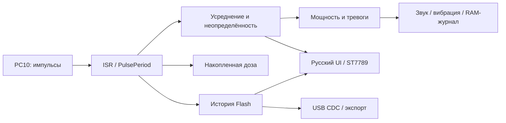

# Архитектура

GC-01 Pro RU — открытая производная Rad Pro, а не патч бинарника FNIRSI.
Используется кооперативный главный цикл, прерывания счётчика и периодический heartbeat;
RTOS и динамические объекты интерфейса не добавляются.

## Структура

| Каталог | Ответственность |
|---|---|
| `firmware/src/stm32` | Регистры, старт, LCD, USB, ADC, Flash, RTC |
| `firmware/src/measurements` | Измерения, адаптивное окно, доза, история |
| `firmware/src/peripherals` | Настройки трубки, периферия, обмен |
| `firmware/src/system` | Настройки, события, время, статистика сеанса |
| `firmware/src/ui` | Отрисовка, меню и bitmap-шрифты |
| `tools/image.py` | Проверка ELF/bin и формирование CRC-образа |
| `tests` | Проверки без прибора; отрисовка синтетических сценариев |

## Измерения

Алгоритмы instantaneous/average/cumulative, коэффициенты профилей и доверительные
интервалы происходят из Rad Pro. Есть быстрый и точный адаптивные режимы,
фиксированные окна 10/30/60 секунд и среднее за выбранное время/до заданной
статистической точности. CPS — импульсы/сек, CPM = CPS × 60.
Коэффициент трубки задан в CPM/(мкЗв/ч); доза интегрируется по импульсам.
Профили не заменяют калибровку конкретной трубки.

Отображаемое ± — статистическая оценка по модели upstream (приближение 95%-интервала),
не полная метрологическая погрешность. На малом числе импульсов относительная оценка
велика, а отсутствие импульсов не доказывает нулевой фон. Отклик на смену уровня,
переполнение/насыщение и dead-time correction должны проверяться генератором импульсов.
Существующий алгоритм тревог ждёт достаточной статистики: его задержку нужно измерить.

Экран «Сеанс» показывает **сырые** min/max CPS за односекундные периоды и среднее
`сумма импульсов / число обработанных периодов`. Это не min/max сглаженной мощности.
Сеанс начинается при старте приложения; после перезапуска обнуляется. В отображении
счётчика свыше 2^32−1 появляется `>4G`, внутренний счётчик 64-битный.

## Настройки и запуск

Структура state имеет собственную сигнатуру формата и CRC32. Повреждённая запись
пропускается; используются последняя корректная запись либо значения по умолчанию.
Проверки диапазонов enum upstream сохранены. UP+DOWN при входе в приложение
пропускает сохранённые настройки, отключает логирование и сон экрана; валидные
накопленные счётчики остаются доступны. Это восстановительный запуск приложения,
не загрузчик и не обещание запуска при повреждении кода.

На Flash выделена одна страница состояний: записи добавляются последовательно,
при заполнении страница стирается. **Отключение питания во время стирания может
потерять последние настройки и счётчики**. CRC отсеивает неполную запись, но не
обеспечивает двухстраничную транзакцию. Новый формат не импортирует настройки Rad Pro.

## Изменения относительно Rad Pro

* Отдельный CH32/RU target, строгая граница приложения и запрет runtime-записей в код/bootloader.
* CRC состояния, bypass настроек по UP+DOWN, собственная сигнатура формата.
* Тёмная палитра navy/mint по умолчанию, полный русский малый алфавит Noto Sans.
* Статистика сеанса и кольцевой журнал переходов тревог (мощность/доза/ошибка трубки).
* qfplib исключена. Используются soft-float GCC и IEEE-функции newlib;
  компактные преобразования log2/log10/exp2/pow сохранены по структуре upstream.
  pow здесь используется только с положительным основанием; это не общая реализация libm.
* C-only startup без CRT завершения процесса, naked Reset_Handler с локальным literal pool.
* Генератор случайных чисел убран из меню ради Flash; игры и EMF не включены.

## Что ещё требует железа

Запуск после штатного bootloader; его версия и способ передачи управления; HV;
LCD/кнопки/заряд/RTC/USB; длительный импульсный стресс-тест; пропуски heartbeat во время
стирания Flash; стек; отключение питания в каждой фазе сохранения; эталонная калибровка;
восстановление владельческого полного дампа. Сборка и desktop-рендер не заменяют эти проверки.
